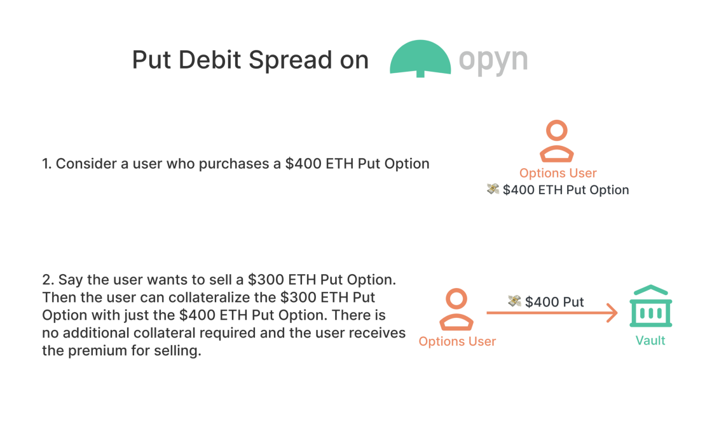

# Opyn v2 FAQ

### What are options?

Options give option buyers the right, but not the obligation to buy or sell the option's underlying asset at the strike price by the expiry date.

* An option that gives the option buyer the right to buy the underlying asset is called a _call option_
* An option that gives the option buyer the right to sell the underlying asset is called a _put option_

Options sellers earn a premium in return for taking on this obligation to either buy the underlying from or selling the underlying to the option buyer.

Here are some resources to learn more about options:

* [Khan Academy](https://www.khanacademy.org/economics-finance-domain/core-finance/derivative-securities)
* [OptionAlpha](https://optionalpha.com/members/video-tutorials/options-basics)
* [Investopedia](https://www.investopedia.com/options-basics-tutorial-4583012)

There are also lots of great conversations on our [discord](https://tiny.cc/opyndiscord), and we’re happy to answer any questions :\)

### What kind of options are available on Opyn?

Opyn v2 offers European, cash-settled options that auto-exercise upon expiry.

* European options mean that option holders can exercise options only upon expiry
* Cash settlement means that option holders don’t have to provide the underlying asset in order to exercise. Rather, the options are settled in the collateral asset, and option holders receive the difference between the price of the underlying asset at expiry and the strike price from option sellers.

* The protocol now has auto-exercise for [in the money](https://www.investopedia.com/terms/i/inthemoney.asp#:~:text=Key%20Takeaways,at%20the%20money%20%28ATM%29.) options, so option holders don’t need to take action before or at expiration. Upon expiry, proceeds for long and short option holders are calculated and can be redeemed at any point after the proceeds have been finalized with a settlement price. Users can redeem by clicking a "redeem" button on the interface after expiry.

### What is a spread?

Spreads enable long oTokens to collateralize short oTokens, enabling users to post the max loss of a structure as collateral.

## Trading

### Where do oTokens trade?

Opyn options \(oTokens\) are ERC20s, so they can be trading on any decentralized exchange that follows the ERC20 standard.

On [opyn.co](http://opyn.co) interface they trade on 0x.

### How are oTokens priced?

The pricing of each oToken depends on the exchange where it is trading.

On the [opyn.co](http://opyn.co) interface where oTokens trade on 0x, market makers are placing bids and asks.

### Why can't I change the gas price for buy or sell transactions on the opyn.co interface? 

On the opyn.co interface oTokens trade on 0x. This means that each trade requires a 0x fee which is a function of gas price. That fee needs to be sent in the transaction, so increasing the gas price alters the 0x fee causing the transaction to fail. You can lower the gas price, however lowering the gas price could cause the transaction to take too long, meaning the 0x order will expire and then the transaction will fail. For the transaction to go through we recommend confirming with the pre-set gas price.

### What is market impact? 

Market impact refers to the increase in the average price of a token as the size of a market order gets larger. For larger orders, there might not be enough oTokens available at the best bid or the best ask. In this case, in order to fill the complete order, the price of some of the oTokens will be at a less favorable bid / ask. 

For example, say there is an orderbook with an ask for 15 oTokens at 100 USDC and an ask for 5 oTokens at 105 USDC. Then, if you purchase up to 15 oTokens, you can purchase each oToken for 100 USDC. However, say you wanted to purchase 17 oTokens. Then you could purchase 15 for 100 USDC and 2 for 105 USDC, so the average price for each oToken would be 100.59 USDC, meaning a 0.59% market impact. 

### How does the opyn.co interface calculate total return? 

Total return is calculated as the difference between the initial premium and the current premium, where the current premium is the best bid or ask available. In the case that an option's in-the-money amount is greater than the amount you could sell the option for, the in-the-money amount is used to calculate the total return rather than the current premium. 

### My hardware wallet isn't working with permit, what do I do?  

Some hardware wallets don't support permit signatures. In order to use a normal "approve" instead of permit signatures, you can click the "gear" icon on the top right of the order ticket and select "approve." 

## Limit Orders 

### How do limit orders work? 

Limit orders on opyn.co go through 0x and placing limit orders on Opyn is free, the taker of the order pays fees. 

* Users must lock up collateral for sell limit orders
* Users can cancel limit orders at any time by returning to the orderbook
* Cancellation of limit orders costs gas
* Orders will be cancelled automatically after the order deadline, and users will not need to pay gas for expired orders
* Orders may be fully filled or partially filled by other users or market makers
* Executed limit orders will appear in the Opyn dashboard
* Users will be notified on screen when a limit order executes, not when a limit order expires unfilled
* Limit orders may not execute immediately. Cancellation of orders and filling orders cost gas, which can cause orders that are crossed to sometimes occur due to gas and 0x fees

To learn more about how to create limit orders on opyn.co, check out [this tutorial](https://medium.com/opyn/opyn-v2-limit-order-tutorial-10efe115ac50). 

### Why are small limit orders less likely to be taken? 

Takers have to pay a [0x protocol fee](https://0x.org/docs/guides/v3-upgrade-guide#protocol-fee) when they buy or sell options. Takers have to pay this fee with each order they fill. For example: 

* If there was an ask for 5 oTokens and the taker wanted to purchase 5 oTokens they would only have to pay the 0x protocol fee once. 
* However, if there were 5 asks for 1 oToken each, the taker would have to pay the 0x protocol fee 5 times. 

Because of the 0x protocol fee, orders are filled based on their total cost \(bid/ask price + 0x protocol fee\), to reduce the total cost to the taker. 

## Building on Gamma

### Can I create a new oToken?

Yes, anyone can create new oTokens if a product has been whitelisted. A product is a combination of specifying the underlying asset, strike asset, and collateral asset for an option and whether it's a call or a put. For any of these whitelisted products, anyone can create a new option, specifying the strike and expiry. Expiration times are currently fixed to 8:00 AM UTC to prevent fragmentation of liquidity across a variety of expirations within the same day.

### What can I build on Gamma?

Opyn v2 allows you to create put and call options with spreads for capital efficiency, and is great for applications ranging from protection and hedging to taking views on different cryptocurrencies. Options are an incredibly versatile financial instrument - in fact you can create [any financial payoff using just put and call options.](https://www.youtube.com/watch?v=rMsu4v-UlkA&feature=youtu.be&ab_channel=MITOpenCourseWare)

[Here's a list of some ideas](https://medium.com/opyn/buidling-with-options-otokens-in-defi-pt-2-f561eb67f4af) you can build with Gamma!

### Where can I get help?

Please join the \#dev channel in the Opyn community [Discord server](https://tiny.cc/opyndiscord). We're always happy to help, so don't hesitate to ask questions!

## Under the Hood

### What is the Gamma Protocol?

‌The [Gamma Protocol](https://github.com/opynfinance/GammaProtocol) is Opyn v2, the most capital efficient on-chain options protocol. You can access the smart contracts here.

### What are oTokens?

‌oTokens are ERC20 tokens that represent options that you have bought or sold. Each oToken corresponds to one unit of the underlying asset. Eg. 1 oETHp is a put option on 1 ETH

### How does auto-exercise work?

The protocol now has auto-exercise for in the money options, so option holders don’t need to take action before or at expiration. Upon expiry, proceeds for long and short option holders are calculated and can be redeemed at any point after the proceeds have been finalized with a settlement price. 

\(Please note that auto-exercise is ONLY available for v2. For v1, you must exercise before expiry here. You can see the [v1 FAQ here](https://opyn.gitbook.io/opynv1/).\)

At the time of expiry, Chainlink nodes provide a live ETHUSD price to the Chainlink aggregator. Opyn's contracts have a short locking period as it takes a short amount of time for the Chainlink oracle price for the expiry time of the options to be available. After the locking period has passed, an oracle price can be submitted. After a price has been submitted, there is a dispute period in which the price can be disputed. If the price is disputed, the disputer can update with a new price. After the dispute period has passed, the settlement value of options are finalized and users can redeem option proceeds or settle their vaults.

The locking period and dispute time periods are different for different assets. Currently WETH-USDC options are available on Opyn v2. For WETH-USDC options, the locking period is 5 minutes and the dispute period is 2 hours. So while the options all expire at 8:00 UTC and are settled with the price of the underlying at 8:00 UTC, users can start to redeem at 10:05 UTC. 

### How do the oracles work?

Cash settlement requires an oracle to determine the payout at expiry. The Gamma protocol architecture is generalizable to allow for different oracles for different assets. We we will initially be launching ETH-USDC options collateralized with USDC. These will use the Chainlink oracle to get the ETH price. There are no liquidations needed as max loss is posted as collateral.

### What is a flash mint?

Since vault collateralization is checked at the end of a transaction, you can mint options without collateral as long as they are burned before the end of the transaction.

Some use cases for flash mint include:

* Arbitrage between dexes or exchanges
* Allows order of operations of transactions not to matter, you can mint and sell options first, and then add collateral in the same transaction
* Allows users to do interesting operations like deposit partial collateral and use the premium received as the rest of the collateral \(ie sell options before they are fully collateralized and then fully collateralize using the proceeds of the sale\)
* Probably many more cool things that we haven't thought of yet!

All of these actions have to be done atomically, within a single transaction. Collateralization is checked at the end of all of these operations/actions and if the collateralization is not correct, it is as if the prior actions/operations never happened and the transaction reverts.

### What is an operator?

Operators are a smart contract feature that allow users to delegate control of their vaults to a third party smart contract. This could be a smart contract that rolls over their options for them, a fund manager to do trades for them, or a vast possibility of other interactions that developers can build on top of the protocol.

Operators have full control over user funds and can take any action on behalf of a user. The only action operators cannot take is to add new operators or remove new operators.

## Opyn v1

### What is happening to Opyn v1?

Opyn v1 laid the foundation for DeFi options as the first live ERC20 options protocol. For the first time, anyone could create, buy, and sell options on any ERC20 token. Opyn v1 will remain live on the Ethereum network, providing a venue for American, physically settled options. We will continue to launch ERC20 options on Opyn v1.

### Where can I find more info on v1?

You can access the Opyn v1 [developer docs and FAQ here](http://opyn.gitbook.io/opyn/). You can interact with the smart contracts via Etherscan, the [Opyn v1 interface](http://v1.opyn.co/), and [OpynMonitor](http://opynmonitor.xyz/), a community built interface.

## Security

### What is the security of the Gamma protocol?

‌The security of the Opyn protocol is our highest priority. Our team has created a protocol that we believe is safe and dependable, and has been audited by OpenZeppelin and formally verified by Certora. All smart contract code is publicly verifiable. You can find the OpenZeppelin audit report here, the Certora report here, and you can find our [bug bounty here](https://opyn.gitbook.io/opyn-v2/get-started/security#bug-bounty-program).

We encourage our users to be mindful of risk and only use funds they can afford to lose. Options are complex instruments that when understood correctly can be powerful hedges. Smart contracts are still new and experimental technology. We want to remind our users to be optimistic about innovation while remaining cautious about where they put their money.

### Does the protocol have any privileged roles?

The protocol currently has the following privileged roles:

* Owner: can whitelist/blacklist collateral and oToken addresses, update/upgrade modules, set addresses for other roles in the system, and manage oracle parameters.
* Full Pauser: can fully pause the system in case of an emergency.
* Partial Pauser: can pause all actions other than redeem oToken and settle vault.
* Farmer: can withdraw any token excess balance in the pool.
* Pricer: can submit oracle prices
* Disputer: can dispute oracle prices

### Help! I can’t access Opyn!

‌Opyn’s smart contracts are on the Ethereum blockchain and are thus always available. If Metamask, or the [Opyn](http://opyn.co/) interface are unavailable, you can always[ access Opyn through the smart contracts](https://opyn.gitbook.io/opyn-v2/get-started/abis-smart-contract-addresses)[.](https://opyn.gitbook.io/opyn/abis-smart-contract-addresses) We also encourage the community to build interfaces to the Opyn v2 protocol.

